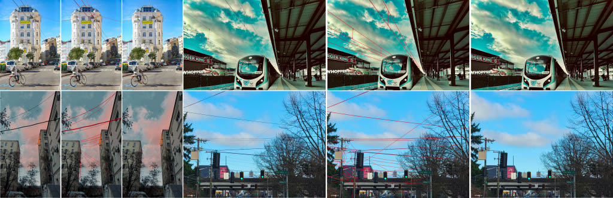

# Automatic High Resolution Wire Segmentation and Removal

<a href="" target="_blank">Mang Tik Chiu</a><sup>1</sup>, <a href="https://ceciliavision.github.io/" target="_blank">Xuaner Zhang</a><sup>2</sup>, <a href="" target="_blank">Zijun Wei</a><sup>2</sup>, <a href="https://yzhouas.github.io/" target="_blank">Yuqian Zhou</a><sup>2</sup>, <a href="https://research.adobe.com/person/eli-shechtman/" target="_blank">Eli Shechtman</a><sup>2</sup>,
<a href="http://www.connellybarnes.com/work/" target="_blank">Connelly Barnes</a><sup>2</sup>, <a href="https://research.adobe.com/person/zhe-lin/" target="_blank">Zhe Lin</a><sup>2</sup>, <a href="" target="_blank">Florian Kainz</a><sup>2</sup>, <a href="" target="_blank">Sohrab Amirghodsi</a><sup>2</sup>, <a href="https://www.humphreyshi.com/" target="_blank">Humphrey Shi</a><sup>1,3</sup>

<sup>1</sup>UIUC, <sup>2</sup>Adobe, <sup>3</sup>University of Oregon

\[<a href="" target="_blank">CVPR 2023</a>\] \[<a href="https://arxiv.org/abs/2304.00221" target="_blank">arXiv</a>\]



---

## WireSegHR Dataset

We release test images from our WireSegHR dataset. The images and annotations can be downloaded <a href="https://drive.google.com/drive/folders/1fgy3wn_yuHEeMNbfiHNVl1-jEdYOfu6p?usp=sharing" target="_blank">here</a>.

## Dataset folder structure

```
WireSegHR
├── images
│   ├── image_1.jpg
│   ...
│   └── image_N.jpg
│
└── gts
    ├── image_1.png
    ...
    └── image_N.png
```

Annotations are paletted binary images with values 0 or 1.
